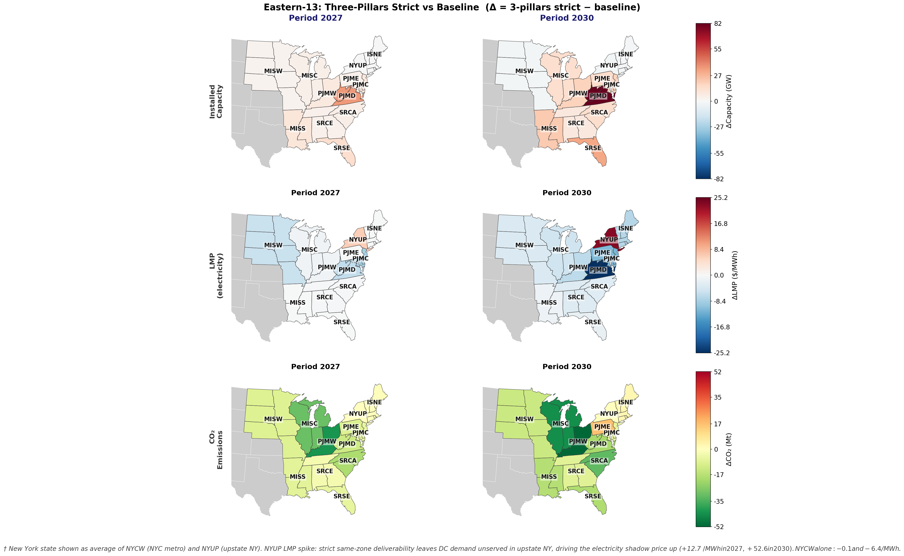

# The Cost of Clean Data: Modeling the IRS 45V Three-Pillars Framework for Data Center Renewable Energy

**David J. Florez Rodriguez, Paulina Jaramillo, Joseph F. DeCarolis**


Engineering & Public Policy, Carnegie Mellon University

---

## Research Question

What are the regional and national impacts of the IRS 45V "three-pillars" framework — requiring newly built, time-matched, and locally delivered renewable generation for data center loads — on electricity system costs, emissions, and total grid capacity?

## Background

The IRS 45V tax credit for clean hydrogen established a precedent for "three-pillars" renewable energy procurement: **additionality** (newly built generation, vintage ≥ 2027), **time-matching** (hourly balance between renewable production and load), and **deliverability** (same-zone or within-RTO supply). Similar requirements are now being applied to data center procurement through voluntary PPAs and emerging state policy — including the Virginia POWER Act and large-scale Illinois PPA frameworks.

This work models the grid-level consequences of enforcing these requirements on data center electricity demand at the regional and national scale.

## Methodology

We use [Temoa](https://github.com/TemoaProject/temoa), an open-source linear programming energy system optimizer, to compute the least-cost expansion of generation and transmission capacity through 2045 as data center and broader electrification loads grow.

**Data sources:**
- Current generation profile and costs: NLR, E3, and the [Public Utility Data Liberation (PUDL) project](https://catalyst.coop/pudl/)
- Future demand, energy costs, and renewable potential: EPRI and EIA
- Existing state policy constraints: RGGI CO₂ cap integrated for ISNE, NYUP, NYCW, PJMD, PJME

**Scenarios modeled:**

| Scenario | Description |
|---|---|
| Baseline | Business-as-usual; data center load served by the regular grid |
| Three-pillars strict | All three pillars enforced; deliverability within the same zone |
| Three-pillars RTO | Deliverability relaxed to within-RTO interconnect |
| Single-pillar runs | Each pillar enforced individually (additionality, time-matching, or deliverability) |
| Two-pillar combinations | All pairwise combinations |
| Nuclear-inclusive | Three-pillars framework with nuclear generation eligible |

Three-pillars scenarios include battery storage fueled exclusively by dedicated renewables, enforcing the hourly balance constraint across all timeslices. Sensitivity analyses vary future demand trajectories, technology costs, and transmission expansion assumptions. Final grid dispatch results are evaluated against a linearized DC optimal power flow on the ACTIVSg synthetic US transmission network.

**Spatial and temporal scope (preliminary runs):**  
13-region Eastern Interconnect subset (ISNE, NYCW, NYUP, PJMC, PJMD, PJME, PJMW, MISC, MISS, MISW, SRCA, SRCE, SRSE); periods 2027 and 2030; 96 timeslices per year (8 representative seasons × 12 hours).



## Preliminary Results

Results below are from reduced-resolution runs (96 timeslices/year) covering 2027 and 2030 and should be treated as directional estimates pending full-resolution analysis.

- **System costs:** The three-pillars framework increases total present-value grid costs by approximately **10% on average** relative to baseline.
- **Emissions:** Three-pillars scenarios decrease system-wide emissions by approximately **15%**.
- **Marginal costs:** Despite higher total costs, three-pillars scenarios lower the present marginal cost of energy by shifting dispatch toward zero-marginal-cost renewables.
- **Deliverability:** Loosening the deliverability constraint (same-zone → within-RTO) reduces the cost premium modestly with little impact on emissions reductions.
- **Storage:** Results show strong reliance on battery capacity — non-dispatchable renewables alone cannot meet the hourly balance requirement, and battery cycling within the dedicated `electricity_dc` commodity becomes the primary mechanism for meeting off-peak data center load.

Results workbooks (baseline vs. strict and baseline vs. RTO comparisons) are in `results/`.

## Policy Implications

Three-pillars procurement rules create distinct costs and benefits for different parties — grid ratepayers, data center operators, renewable developers, and the broader public. This work provides a quantitative foundation for three ongoing policy questions:

1. **45V and its iterations:** How do marginal changes to the three-pillars definition (e.g., annual vs. hourly matching, RTO-level vs. same-zone deliverability) change system costs and environmental outcomes?
2. **Emerging state policy:** Virginia's POWER Act and Illinois large-scale PPAs represent early real-world implementations. We characterize the grid-cost exposure these policies create.
3. **FERC Order 1920 cost allocation:** Our scenario cost deltas directly inform how a regulator might apply the "beneficiary pays" principle to data-center-driven transmission and generation investment.

## Repository Contents

```
results/
── three_pillars_eastern_13_strict_conv_comparison.xlsx   ← baseline vs. strict (same-zone)
── three_pillars_eastern_13_rto_conv_comparison.xlsx      ← baseline vs. RTO

figures/
── eastern_13_regions.png   ← 13-region Eastern Interconnect study area
```

## Reproducibility

Model runs use Temoa v4.0.0a2 with the HiGHS LP solver (`appsi_highs`). Full databases, configs, and run scripts are not included in this repository due to file size (~500 MB source database). Contact the authors or see the [Temoa project](https://github.com/TemoaProject/temoa) for environment setup.

## Contact

David - davidjflorezr \<at\> gmail
